# Google

## Overview
This guide will show you how to set up your game up on Google Play Console and mod.io website for mod.io to process entitlements on your behalf. The mod.io platform will use the Google Play Android Developer API to verify purchases and grant associated entitlements to users who have purchased [mio tokens](#glossary-of-terms) in your game. Conversely, if a user requests a refund, mod.io will revoke the entitlements associated with the refunded purchase.

:::note
To revoke entitlements after refunds, you must tick the remove entitlements checkbox in the refund request, you can also set this value to true programmatically. [Voided Purchases Documentation](https://developers.google.com/android-publisher/voided-purchases).
:::

## Glossary of Terms

* **Google Play Android Developer API**: The Google Play Developer API allows you to perform a variety of publishing and app-management tasks. It provides the functionality to manage in-app products and subscriptions.
* **Service Account**: A service account is a special type of Google account intended to represent a non-human user that needs to authenticate and be authorized to access data in Google APIs.
* **Service Account Credentials**: Service account credentials are used to authenticate the service account when it calls the Google Play Android Developer API. This refers to a JSON file generated on the Google console that contains information to authorize mod.io's servers to communicate with Google Play API on your behalf (To get information about an in-app purchase for verification or consumption purposes).
* **Google Play Console**: The console provided by Google that allows developers to publish and manage applications or games and in-app products on Google Play.
* **Package Name**: The package name is a unique name for your game on the Google Play Store. It is also known as the application ID.
* **Product Id**: The product id is a unique identifier for an in-app product on Google Play. It is used to identify the product when making purchases.
* **mios**: mios are consumable digital tokens that can be purchased within your game and exchanged for game mods on the mod.io platform.

## Use cases
In-app mio purchases for a game published on Google Play Store running on an android mobile device. Mios are consumable in-app digital products that can be used to purchase mods on mod.io.

### Prerequisites

* A play console developer account with a published game on Google Play.
* A game APK uploaded to Google Play Console. For more instructions on how to upload an APK, see the [official documentation](https://support.google.com/googleplay/android-developer/answer/9859152#zippy=%2Cproduct-details).
* You will also need to have a Google Cloud Console account to create a service account and enable the Google Play Android Developer API.
* A game set up on mod.io with monetization marketplace enabled.

### Setting In App Products on Google Play Console
This section assumes you have a game set up on Google play console. Follow the [official guide](https://support.google.com/googleplay/android-developer/answer/9859152#zippy=%2Cproduct-details) if that's not the case.

1. To set up in-app products on Google play console, go into your game's dashboard, then navigate to the **Monetise > In-app products** section on the Google Play Console and click **Create product**.
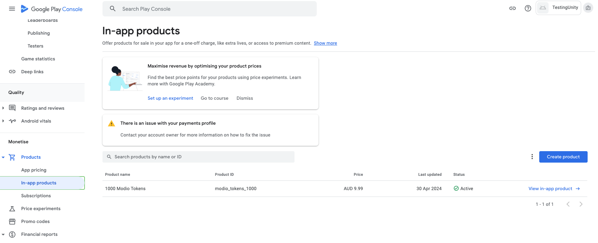

2. Fill in the product id, name, description and price for the product.

3. Under tax and compliance settings, select **Digital content**, then select **This is not a streaming product** and then click **Apply**.

4. Click **Save** to save the product then click **Activate** to make the product available for purchase.

5. Repeat steps 1-4 as needed based on how many products you offer for purchase in your game. Take note of the product ids as you will [need it later](#register-your-product-on-modio).

### Register your product on mod.io

1. Go to the mod.io dashboard and navigate to **Admin > Monetization**, marketplace must be enabled to access this screen.

2. Navigate to **Settings > Manage Skus** and select the token pack you'd like to associate with the Google Play product.

3. Select Google from the dropdown and enter the Google Product Id(s) from Google Play Console ([from the previous section](#setting-in-app-products-on-google-play-console)), click **save**.
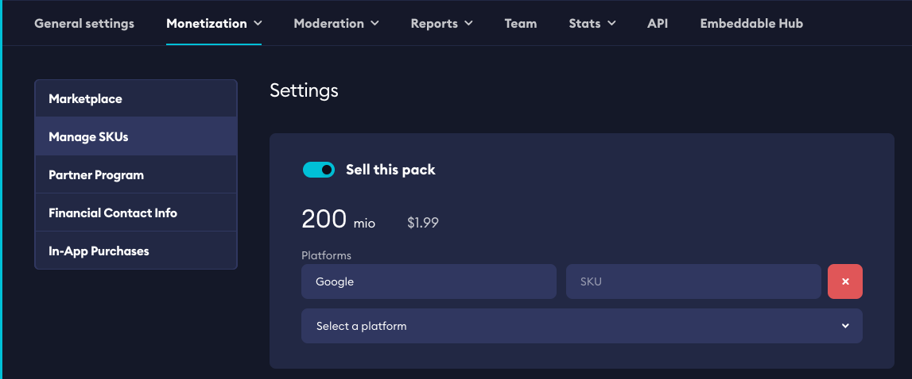
   
### Processing Google Play entitlements on mod.io

1. Go to Google Cloud Console and select your project. On the Enabled APIs and Services tab, click **Enable APIs & Services**.
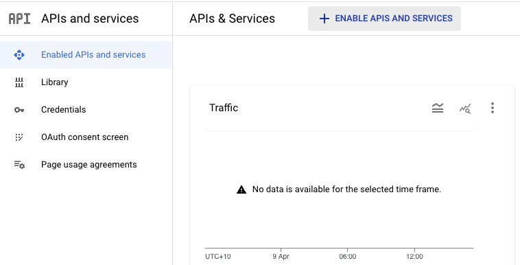

2. Select Google Play Android developer API and enable it for the project.
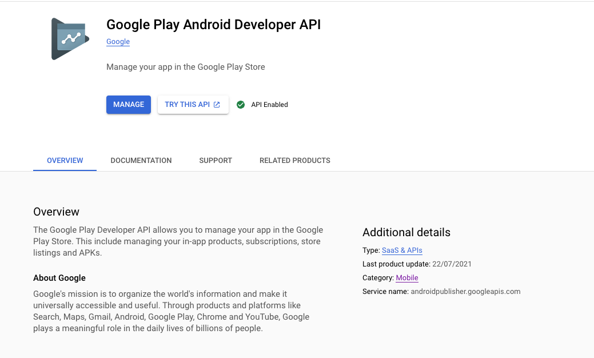
 
3. Click **create credentials** and select **application data** as the option value, then click **next**.

4. On the service account screen, fill out the required information i.e., Service account name, id, and description. Click **Create and continue** 
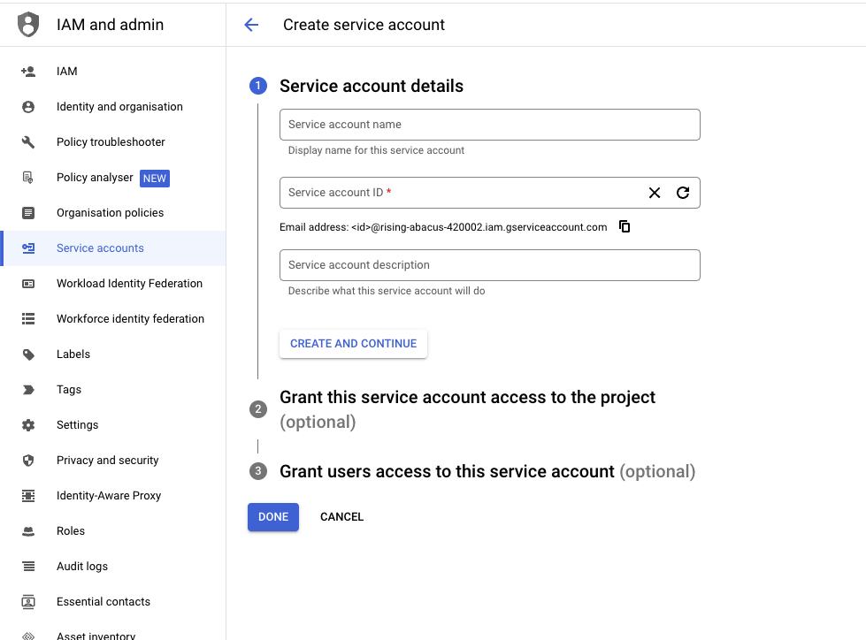

5. Grant this service account access to the project as either an editor or owner in the roles dropdown as illustrated below, click **done**. 
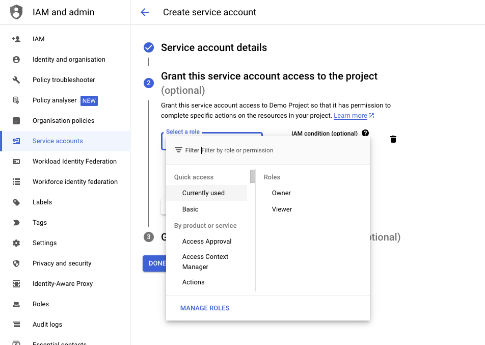
 
6. Next, go to **Credentials > Service accounts** and select the service account we just created. Click the **keys** tab and **add key**.
 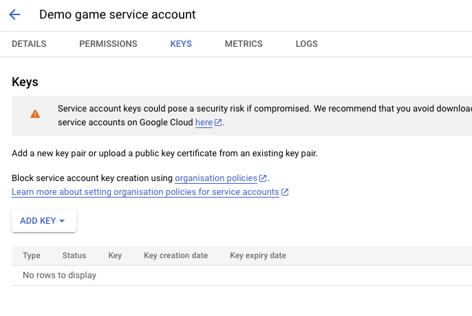

7. Select the JSON option and click **Create** to generate a service account JSON file. Save this file securely to be used [later on mod.io](#configuring-your-games-google-client-id-and-package-name-on-modio).
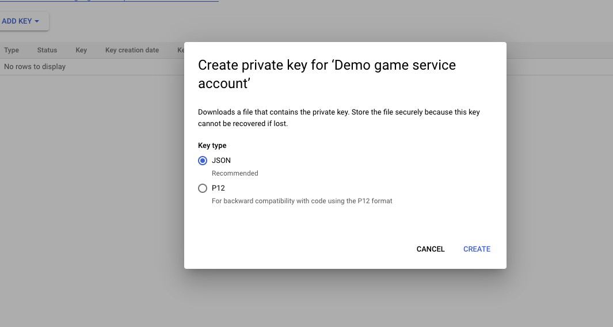

8. Go to the menu tab and scroll down through the available products to the pubsub service, click on it.

9. Create a topic, you can use the default settings provided by Google console.
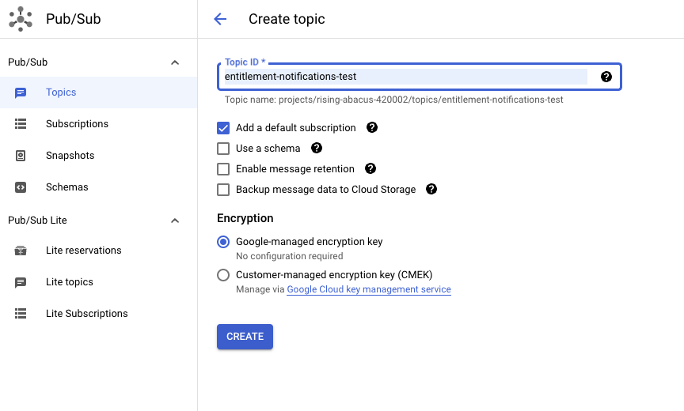

10. Navigate to the topic created and click on the **add subscription** button, fill in the subscription name, select push and insert `https://mod.io/v1/notifications/google` as the **endpoint url** then click **create**.
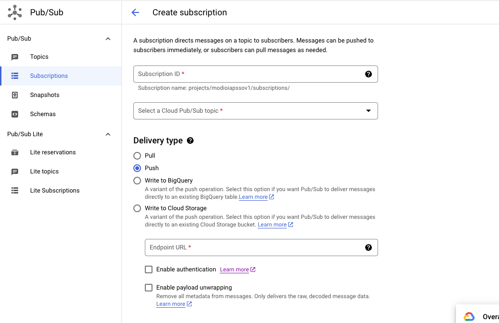

11. Go into the subscription we just created and add `google-play-developer-notifications@system.gserviceaccount.com` as a principal to the subscription, granting it the role of **pubsub publisher** and **save**.
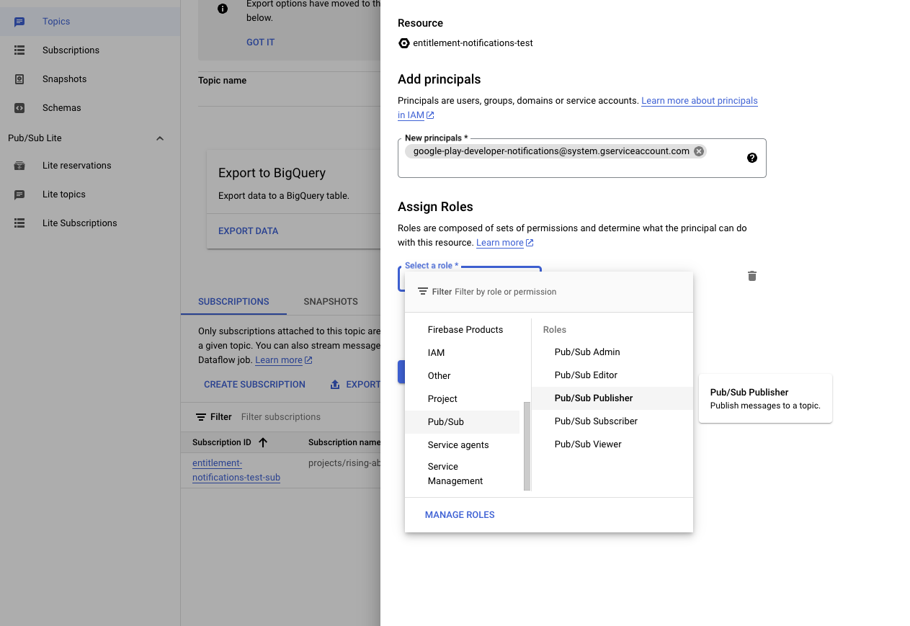

12. Navigate to Google Play console and select **users and permissions**, add the service account email address to the list of users with access to the Google Play Console from **Step 7**.
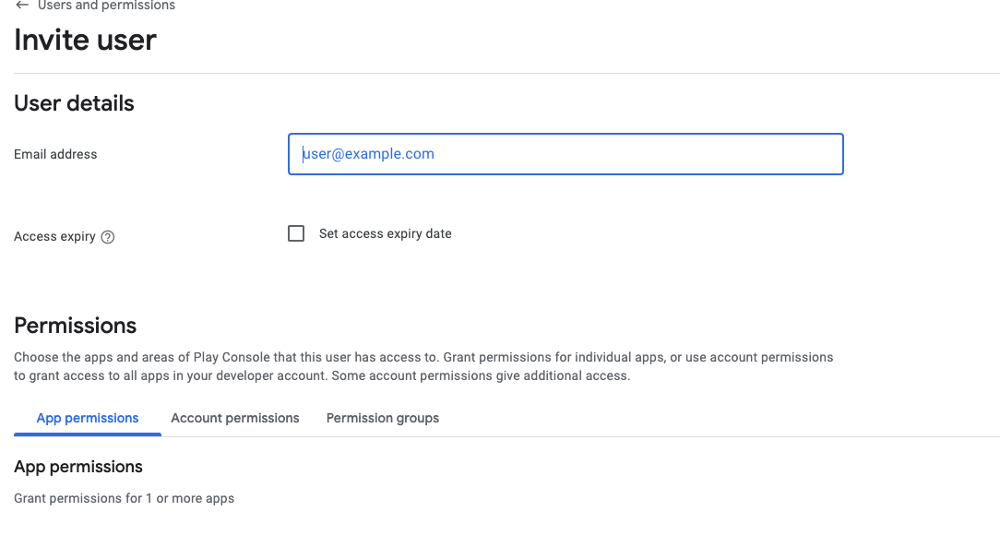

13. Go to the **App Permissions** tab click on the **Add app** button, select your app and click apply.
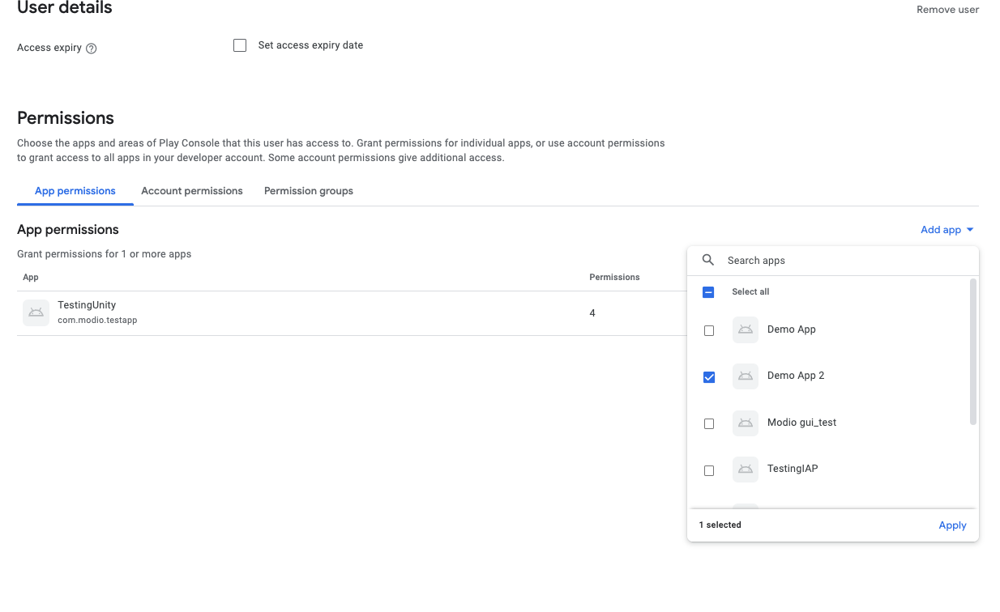

14. Go to the **Account Permissions** tab and grant the service account access to **Financial data, orders, and cancellation survey responses**, click **invite user**. On the next screen, click **send invitation**.
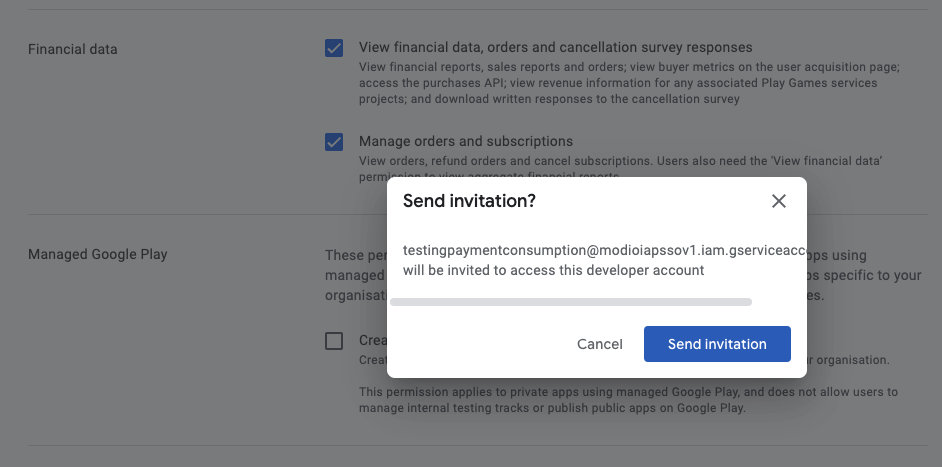

15. Select your app and navigate to monetization setup, scroll down to real time developer notifications and click **edit**. Enable the notifications and select the topic we created in **Step 9**. Click send test message to verify your setup. Select **Get all notifications for subscriptions and one-time products** then **save changes**.

### Configuring your games Google Client ID and Package Name on mod.io

1. On the mod.io website, navigate to your [game's admin dashboard](https://mod.io/content) and go to the **Settings** tab.

2. Under **Admin > General Settings** find and click on the **Platform Entitlements**.

3. Enter the **Google Client ID**, **Google Package Name** and **service account JSON file contents** we saved in **Step 7**, and **Save Changes**.

## References

* [Creating and setting up your app](https://support.google.com/googleplay/android-developer/answer/9859152#zippy=%2Cproduct-details)
* [Getting started with Android Publisher](https://developers.google.com/android-publisher/getting_started)
* [Voided Purchases](https://developers.google.com/android-publisher/voided-purchases)
* [Real Time Developer Notifications](https://developer.android.com/google/play/billing/getting-ready#configure-rtdn)